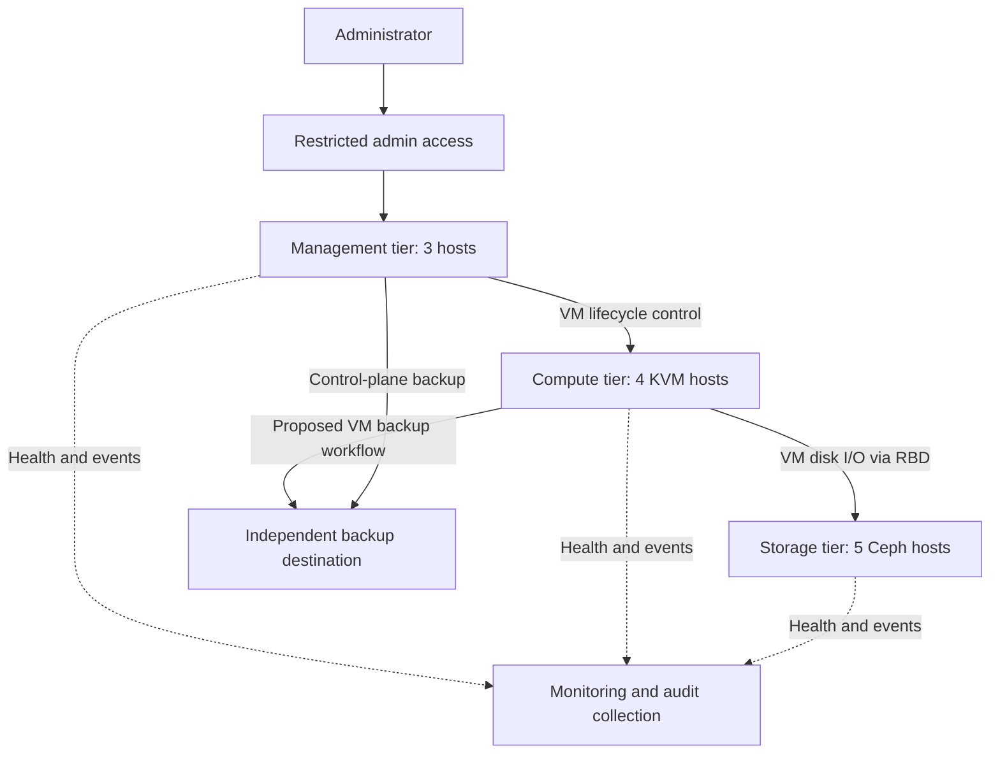

# Private Cloud Reference Architecture
## OpenNebula · KVM · Ceph

**Status: this reference design is conceptual and has not been deployed or lab-validated.**

Written from hands-on experience deploying and operating platforms of this type in production. The design here is an independent, fictional study rather than a description of any deployed system.

A personal architecture study for a fictional organization that needs a virtual-machine platform with independent compute and storage growth, controlled administrative access, and recovery from a single host failure.

This repository does not describe an employer or customer environment. All topology choices are illustrative. It includes no production measurements or internal configurations, and makes no claim that this specific reference design has been implemented.

## The design question

How should a small private cloud be structured so that a hardware failure does not become an uncontrolled recovery event?

The proposed answer separates management, compute, and storage, and treats spare capacity, failure detection, fencing, and recovery validation as explicit design requirements.

### Scope and assumptions

- One site; site-wide disaster recovery is outside this first design.
- Four equal-capacity KVM compute hosts.
- Five equal-capacity Ceph storage hosts.
- Three independent management hosts for the proposed OpenNebula control plane.
- Two network switches with a validated redundant attachment design.
- One failure at a time, starting from a healthy cluster.
- VM restart after a failed compute host is acceptable; uninterrupted application service is not promised.
- Backups live outside the primary storage cluster.

These counts illustrate failure domains and capacity calculations; they are not a purchasing recommendation. Exact software versions, hardware, workload profiles, recovery targets, and supported HA configurations remain to be selected.

## Logical architecture



This is a logical relationship diagram. It does not specify cables, ports, routing, or a complete backup implementation. The management tier controls VM operations; guest disk I/O should not pass through it.

| Layer | Proposed responsibility | Design condition |
|---|---|---|
| Management | OpenNebula API, scheduling, and administrative services | Use a supported release-specific HA arrangement; include its database, endpoint, and service dependencies |
| Compute | KVM hosts running guest VMs | Reserve capacity for one host loss and validate fencing before restart |
| Storage | Ceph RBD-backed VM disks | Place replicas across hosts and preserve capacity for recovery |
| Network | Management, guest, storage, and out-of-band traffic | Separate trust boundaries; validate switch and link failover |
| Operations | Health checks, alerts, logs, backups, and recovery procedures | Verify recovery using application probes and restore tests |

Management services are proposed on infrastructure independent of the managed compute tier, so recovering that tier does not first require its own control plane to restart there. Three management hosts alone do not establish HA: the selected OpenNebula release's supported topology and all dependent services must be designed and tested.

## Three key decisions

### 1. Separate compute and storage

**Decision:** use dedicated KVM and Ceph hosts.

**Reason:** storage capacity can grow without adding compute capacity, and a compute-host outage does not simultaneously remove storage daemons.

**Trade-off:** more machines, networking, and operational responsibilities than a compact hyperconverged design. A hyperconverged lab remains a valid alternative when footprint matters more than independent growth.

### 2. Use host-level storage replication

**Proposal:** an RBD pool with `size = 3`, `min_size = 2`, and a CRUSH rule that places replicas on different storage hosts. Ceph documents replica count, minimum I/O requirements, and placement rules in its [pool documentation](https://docs.ceph.com/en/squid/rados/operations/pools/).

Five storage hosts leave candidate failure domains for rebuilding replicas after one host is lost, subject to available capacity and placement constraints. This does not promise tolerance of arbitrary overlapping failures.

Three Ceph monitors are proposed on three distinct storage hosts, with redundant manager daemons on separate hosts. The monitor majority must remain reachable; see [Ceph monitor quorum guidance](https://docs.ceph.com/en/squid/rados/operations/add-or-rm-mons/).

**Trade-off:** three replicas consume roughly three times the logical data capacity before additional overhead. During recovery, replication competes with guest I/O.

### 3. Budget for failure before admitting workloads

**Decision:** evaluate capacity after losing the largest host.

For four equal compute hosts, each with allocatable memory `M`:

```text
Normal aggregate memory = 4 × M
Memory after one host loss = 3 × M
Illustrative workload budget = 0.80 × 3 × M = 2.4 × M
```

This example admits workloads up to 60% of normal aggregate allocatable memory, leaving a further 20% margin after failure. It is a deliberately chosen planning assumption, not a universal utilization target. CPU demand, VM placement, affinity, NUMA, and per-VM fit need separate checks.

For five equal storage hosts, each contributing raw OSD capacity `D`:

```text
Raw capacity after one host loss = 4 × D
Illustrative logical-data budget = (0.70 × 4 × D) / 3
```

The 70% assumption reserves space after failure and re-replication. This is an approximate upper planning bound before metadata, imbalance, and other overhead; it is not a configured Ceph fullness threshold or a usable-capacity guarantee.

## One failure scenario: compute host loss

**Starting point:** storage and management are healthy; disposable guest workloads run across the compute hosts.

1. A compute host becomes unreachable.
2. Monitoring distinguishes a host failure from a management-path failure as far as possible.
3. Recovery confirms the original host is fenced or safely powered off. A lost heartbeat alone is insufficient evidence that a VM has stopped.
4. The recovery workflow checks surviving-host capacity and placement constraints.
5. Affected VMs are restarted on eligible hosts, using their shared disks.
6. Guest and application probes establish whether service has recovered.

**Expected interruption:** affected guests stop serving while failure detection, safe isolation, scheduling, boot, and application recovery occur. This is restart-based recovery, not live migration from a dead host.

If fencing cannot be confirmed, the proposed policy is to stop automated restart and escalate rather than risk two instances accessing the same writable disk. The actual mechanism and OpenNebula integration must be selected for the lab.

## Validation plan

**All tests below are proposed for this reference design; none has been executed as part of this study.** Run disruptive tests only in an isolated lab with disposable data and an established restoration path.

| Test | Evidence to capture | Acceptance condition |
|---|---|---|
| Compute host loss | Detection, fencing, restart, and application-recovery timestamps | No duplicate VM execution; restart occurs only after safe isolation; application returns within an agreed target |
| Management-path isolation | Host reachability from independent paths and recovery decisions | No unsafe restart based solely on loss of management connectivity |
| One storage host loss | Ceph health, replica placement, guest I/O errors, latency, and recovery progress | Guest I/O remains available under the chosen policy; replication returns to target after recovery |
| One monitor loss | Quorum membership and health events | Remaining monitors maintain a majority |
| Control-plane node loss | Leader/service status and API probes | Supported failover works, including endpoint and database dependencies |
| One network switch loss | Link state and guest, storage, and management probes | Traffic recovers through the surviving path within an agreed target |
| Backup restore | Restore logs, checksums, and application checks | An isolated restored VM and its application are usable |

Record the exact software versions, hardware or virtualization constraints, load, timestamps, and unexpected behavior for each test. A nested lab can demonstrate workflows but cannot prove physical switch redundancy, power fencing, or production storage performance.

## Security and operations requirements

- Restrict management interfaces to authorized administrative paths.
- Use named identities, least privilege, and MFA where supported by the chosen access stack.
- Separate guest, storage, management, and out-of-band access; VLANs alone do not define authorization.
- Validate TLS and restrict Ceph credentials to the required pools and operations.
- Alert on quorum changes, degraded storage, recovery backlog, capacity pressure, failed backups, and unavailable hosts.
- Keep credentials outside Git; use only fictional names and disposable data in future lab examples.
- Test independent backups. Replication and snapshots on the primary cluster do not provide an independent recovery copy.

These are design requirements, not assertions that controls have been configured or compliance has been achieved.

## Limitations and next steps

This first version is an architecture and decision record. It contains no deployment automation, benchmark results, availability SLA, or completed test evidence.

1. Select a compatible OpenNebula, Ceph, Linux, QEMU, and libvirt version set.
2. Resolve the supported control-plane HA arrangement, fencing integration, network failover, and backup workflow.
3. Build a reproducible personal lab.
4. Execute the validation matrix and publish measured results, including failures and unresolved issues.

Consult the [OpenNebula documentation](https://docs.opennebula.io/) for the chosen release before implementation. The Ceph links above reference Squid documentation for the described concepts; they do not establish a tested compatibility matrix.
